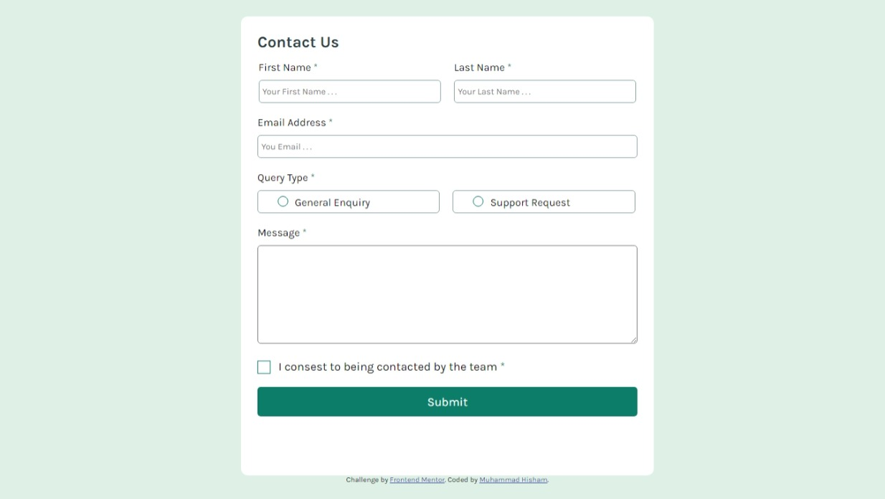

# Frontend Mentor - Contact form solution

This is a solution to the [Contact form challenge on Frontend Mentor](https://www.frontendmentor.io/challenges/contact-form--G-hYlqKJj). Frontend Mentor challenges help you improve your coding skills by building realistic projects.

## Table of contents

- [Overview](#overview)
  - [The challenge](#the-challenge)
  - [Screenshot](#screenshot)
  - [Links](#links)
- [My process](#my-process)
  - [Built with](#built-with)
  -[Features](#features)
- [Author](#author)

## Overview

### The challenge

This project is a contact form built to practice HTML, CSS, and JavaScript skills. The form adapts to different screen sizes and validates input fields for user-friendly interaction. It's part of the Frontend Mentor challenges, designed to help improve frontend development skills.

### Screenshot

### Links

- Live Site URL: [Live URL](https://contact-form-main2024.vercel.app/)

## My process

### Built with

- Semantic HTML5 markup
- CSS
- Flexbox
- Mobile-first workflow
- Vanilla JavaScript

### Features

- Responsive Layout: Works across desktop, tablet, and mobile devices.
- Form Validation: Client-side validation for fields like name, email, and message.
- Error Handling: Real-time feedback when inputs are invalid, with clear messages.
- Accessible Design: Uses semantic HTML elements and ARIA labels for accessibility.

## Author

- Frontend Mentor - [@mohamedhesham221](https://www.frontendmentor.io/profile/mohamedhesham221)
- Linkedin - [Muhammad Hisham](https://www.linkedin.com/in/muhammad-hisham-23544b253/)
